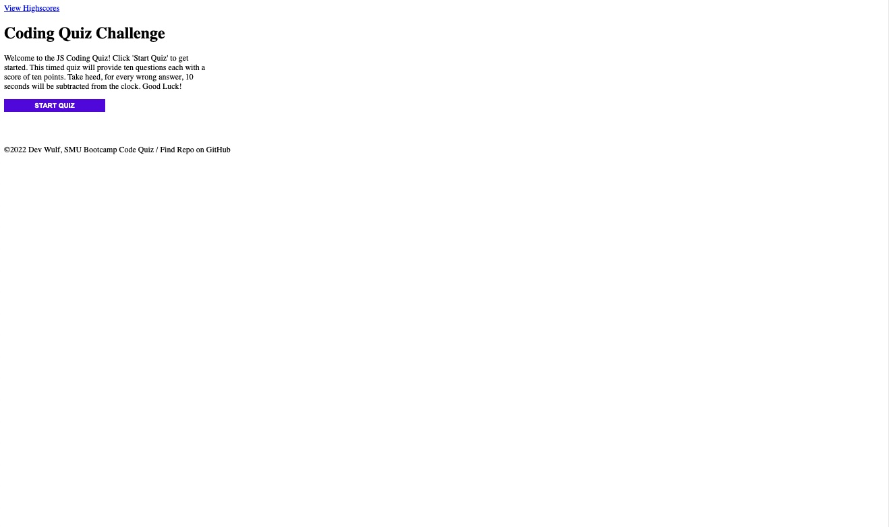
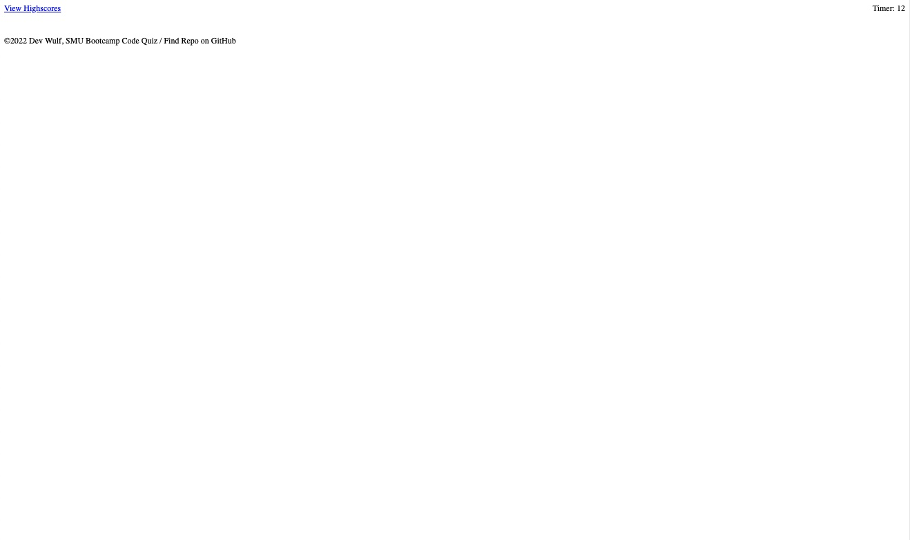

# Web APIs: Code Quiz

## Objective

Create a web page that utilizes HTML and CSS through Javascript to create a dynamic timed multiple choice quiz. 
This quiz will have the following functionality:

  * Multiple choice quiz will have a countdown timer.

  * Each question will be answered using multiple choice.

  * Correct answers will increase a score by 10 points.

  * Each wrong answer will dox 10 seconds from the timer.

  * Each answer regardless of outcome will continue to the next screen.

  * If the timer runs out or all questions have been answered, the game ends and a game over screen appears

  * User will have option to document initials and score will be saved.

  * Once User saves information, a highscore screen appears displaying User's game score and initials.

## 👑 Quest Items👑.

🧚🏻 Hey! Listen!

  * Progress through the bootcamp to gain more Quests!

  * Gain understanding on how .forEach() works.

    ~~* Learn how to manipulate HTML in JavaScript.~~

  * Visit the higher plane with the Z-Index and learn it's wisdom.

## JavaScript Updates

* Created boiler plate that will contain a majority of code.

* Added multiple choice questions into an Array.

* Placeholder comments in DOM order.

* Created Header and set param to space-between.

* Created 'Highscores' and add timer paceholder.

* Created Quiz container that will house the majority of functions. Added flex attributes.

* Created content for quiz Start and set styling attributes.

* PURPLE ~~BEES~~ BUTTONS FOR EVERYONE!!! YOU GET A BUTTON.. YOU GET A BUTTON!!

* Housecleaning, compartmentalized code into groups for readability and general cleanliness.

* Added event listener to start button. When clicked, begin timer.

* Built in game functionality.

* Created question loop. This will loop to the next question and notify if answer is correct of incorrect.

* created point structure. 10 points for every correct answer, -10 secs for every incorrect answer.

## HTML Updates

* Added HTML boiler plate and created div.id containers to house variables.

## CSS Updates

* None

## Troubleshooting

* An issue where the questions would not appear after click.

## ScreenShots

## Links

[GitHub Repo](https://github.com/wulfsounds/web-api-quiz)

[GitHub Page](https://wulfsounds.github.io/web-api-quiz/)

## Sources

Questions are sourced or inspired from [W3Schools](https://www.w3schools.com/quiztest/quiztest.asp?qtest=JS) and [JavaTPoint](https://www.javatpoint.com/javascript-quiz).
